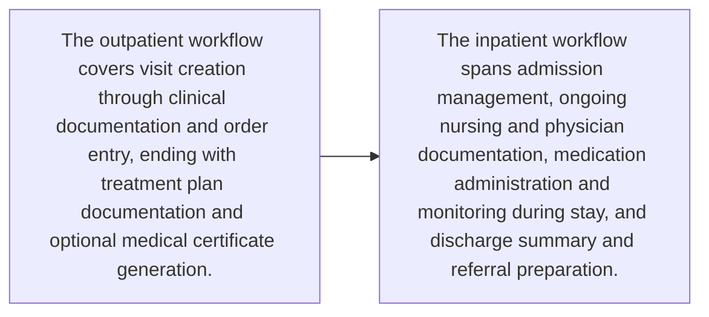

# Functional Requirements

This document captures the build-ready functional scope for **Features of the Medical Records System (MRS)**.

## Functional coverage snapshot

| Area | Value |
| --- | --- |
| Features | 10 |
| Workflows | 2 |
| Business rules | 1 |
| Data entities | 3 |
| Integrations | 5 |
| Constraints | 2 |

## Workflow map

## Features and capabilities

### FR-01 — Patient registration and profile management

- **Source:** Lines 13-19

Support core patient administration capabilities:
- Register patients
- Search patients by HN, national ID, name, or phone number
- Detect duplicate patients
- Enter demographic data
- Update patient profiles
- Manage allergy records
- Manage emergency contact information

### FR-02 — Outpatient medical record management

- **Source:** Lines 23-35

Support outpatient care documentation and ordering:
- Create OPD visits
- Record vital signs
- Document chief complaint, HPI, PMH, family history, medication history, and physical examination
- Record ICD-10 diagnoses
- Enter medication orders
- Enter lab and X-ray orders
- Document treatment plans
- Generate medical certificates

### FR-03 — Inpatient admission and inpatient record management

- **Source:** Lines 39-47

Support inpatient care activities:
- Manage patient admissions
- Document nursing notes
- Document doctor progress notes
- Chart intake and output
- Monitor continuous vital signs
- Manage Medication Administration Records (MAR)
- Enter lab and X-ray orders during admission
- Prepare discharge summaries with ICD-10 and ICD-9-CM
- Document referrals

### FR-04 — Medication and pharmacy management

- **Source:** Lines 51-57

Support medication and pharmacy operations:
- Enter medication orders
- Check drug interactions
- Check allergies
- Manage dispensing workflow
- Track lot numbers and expiry dates
- Manage drug inventory
- Produce drug utilization reporting

### FR-05 — Laboratory order and result management

- **Source:** Lines 61-66

Support laboratory operations:
- Enter laboratory orders
- Print barcodes
- Enter laboratory results
- Integrate laboratory results with medical records
- Display laboratory results graphically
- Report turnaround time (TAT)

### FR-06 — Imaging and radiology management

- **Source:** Lines 70-73

Support imaging-related capabilities:
- Create imaging orders for X-ray, CT, and MRI
- Enter radiologist reports
- Attach images in DICOM or JPEG formats

### FR-07 — Clinical document management

- **Source:** Lines 77-80

Support storage and retrieval of clinical documents:
- Upload documents
- Store consent forms
- Store medical certificates
- Store referral documents

### FR-08 — Appointment scheduling and reminder management

- **Source:** Lines 84-87

Support appointment operations:
- Schedule patient appointments
- Send SMS/LINE reminders
- Manage doctor schedules
- Report no-shows

### FR-09 — Billing and insurance management

- **Source:** Lines 91-95

Support financial processing:
- Calculate charges
- Manage medication, procedure, and room charges
- Verify insurance eligibility
- Generate invoices and receipts
- Produce revenue reporting

### FR-10 — Operational and statutory reporting

- **Source:** Lines 142-146

Support reporting for operational monitoring and external obligations:
- Daily patient census reports
- ICD-10 disease reports
- Drug utilization reports
- OPD/IPD statistical reports
- Reports for the provincial health office / NHSO

## Workflows and process steps

### WF-01 — OPD encounter documentation workflow

- **Source:** Lines 23-35

The outpatient workflow covers visit creation through clinical documentation and order entry, ending with treatment plan documentation and optional medical certificate generation.

### WF-02 — IPD admission-to-discharge workflow

- **Source:** Lines 39-47

The inpatient workflow spans admission management, ongoing nursing and physician documentation, medication administration and monitoring during stay, and discharge summary and referral preparation.

## Business rules

### BR-01 — Medication safety checks

- **Source:** Lines 51-57

Medication handling shall include:
- Drug interaction checking
- Allergy checking

## Data entities

### DE-01 — Patient master profile

- **Source:** Lines 13-19

The patient record includes at least:
- Demographic data
- Allergy information
- Emergency contact information
- Identifiers used for lookup, including HN, national ID, name, and phone number

### DE-02 — OPD encounter record

- **Source:** Lines 23-35

An outpatient record contains structured encounter information such as vital signs, clinical history, examination findings, diagnoses, medication orders, lab/X-ray orders, treatment plans, and medical certificates.

### DE-03 — Medication inventory and dispensing traceability

- **Source:** Lines 51-57

Medication-related data includes order details, dispensing status, drug inventory, lot numbers, and expiry dates.

## Integrations

### INT-01 — Laboratory results integrated with medical records

- **Source:** Lines 61-66

Laboratory results must integrate into the medical record so diagnostic outcomes are available within the patient record context.

### INT-02 — PACS and image support

- **Source:** Lines 70-73

The system shall integrate with PACS and support image attachment handling for DICOM and JPEG content.

### INT-03 — SMS and LINE reminder integration

- **Source:** Lines 84-87

The appointment module requires outbound reminder capability through SMS and LINE channels.

### INT-04 — Insurance eligibility verification

- **Source:** Lines 91-95

The billing and insurance scope includes eligibility verification against insurance-related systems or services.

### INT-05 — External system integrations

- **Source:** Lines 134-138

The system shall integrate with:
- HIS via APIs
- Laboratory systems
- PACS
- Billing systems
- Insurance and eligibility systems

## Constraints

### CON-01 — Supported document upload formats

- **Source:** Lines 77-80

Document uploads are specified for PDF and JPG formats.

### CON-02 — Clinical coding and regulatory compliance

- **Source:** Lines 124-130

The solution shall align with:
- ICD-10 compliance
- ICD-9-CM compliance
- LOINC compliance
- PDPA compliance
- Ministry of Public Health medical record standards
- Healthcare data security standards

## Engineering delivery notes

- **BR-01 — Medication safety checks**
  - Medication handling shall include: - Drug interaction checking - Allergy checking
  - Suggested follow-up: Review 'Medication safety checks' with the delivery team.
- **INT-01 — Laboratory results integrated with medical records**
  - Laboratory results must integrate into the medical record so diagnostic outcomes are available within the patient record context.
  - Suggested follow-up: Review 'Laboratory results integrated with medical records' with the delivery team.
- **INT-02 — PACS and image support**
  - The system shall integrate with PACS and support image attachment handling for DICOM and JPEG content.
  - Suggested follow-up: Review 'PACS and image support' with the delivery team.
- **INT-03 — SMS and LINE reminder integration**
  - The appointment module requires outbound reminder capability through SMS and LINE channels.
  - Suggested follow-up: Review 'SMS and LINE reminder integration' with the delivery team.
- **INT-04 — Insurance eligibility verification**
  - The billing and insurance scope includes eligibility verification against insurance-related systems or services.
  - Suggested follow-up: Review 'Insurance eligibility verification' with the delivery team.
- **INT-05 — External system integrations**
  - The system shall integrate with: - HIS via APIs - Laboratory systems - PACS - Billing systems - Insurance and eligibility systems
  - Suggested follow-up: Review 'External system integrations' with the delivery team.
- **CON-01 — Supported document upload formats**
  - Document uploads are specified for PDF and JPG formats.
  - Suggested follow-up: Review 'Supported document upload formats' with the delivery team.
- **CON-02 — Clinical coding and regulatory compliance**
  - The solution shall align with: - ICD-10 compliance - ICD-9-CM compliance - LOINC compliance - PDPA compliance - Ministry of Public Health medical record standards - Healthcare data security standards
  - Suggested follow-up: Review 'Clinical coding and regulatory compliance' with the delivery team.